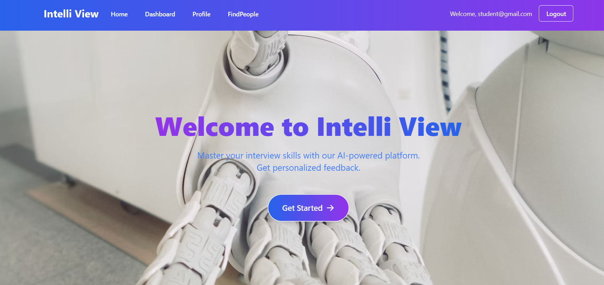
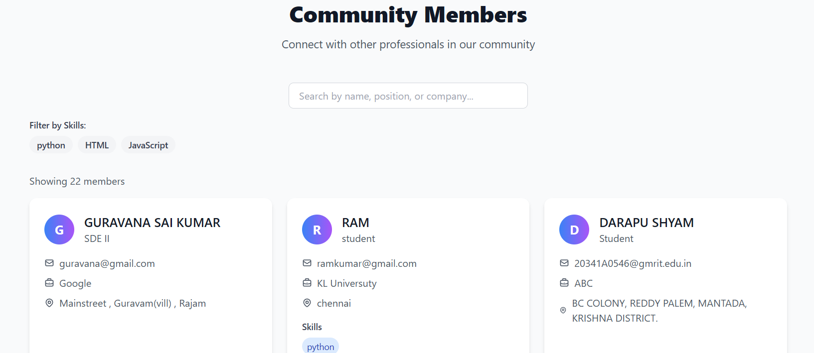
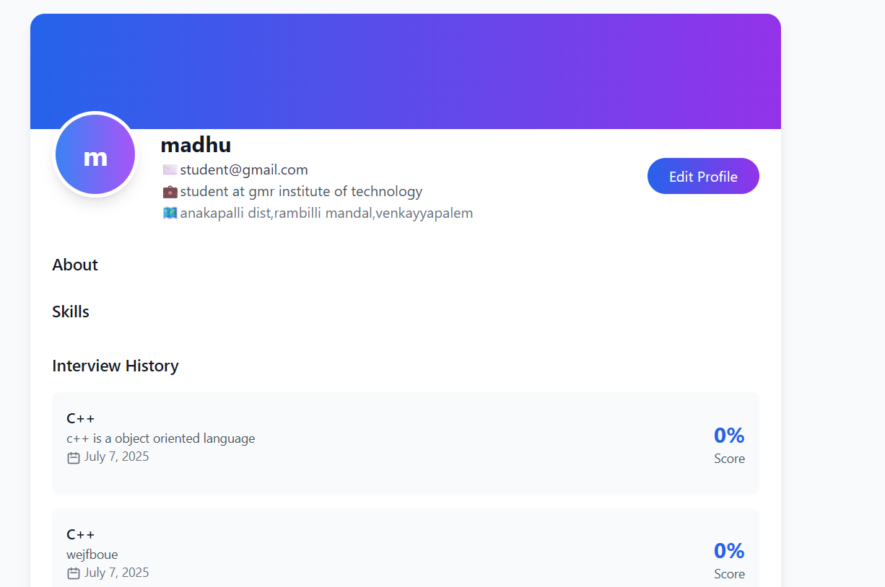
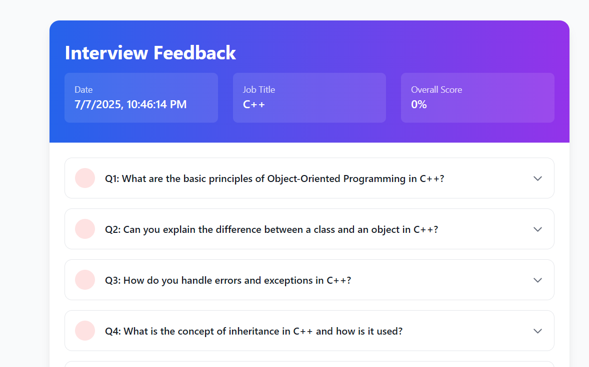
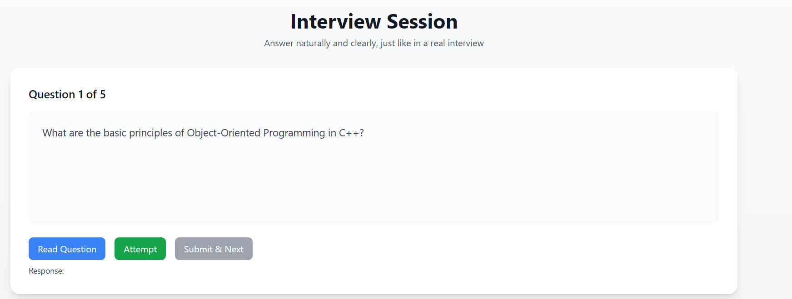
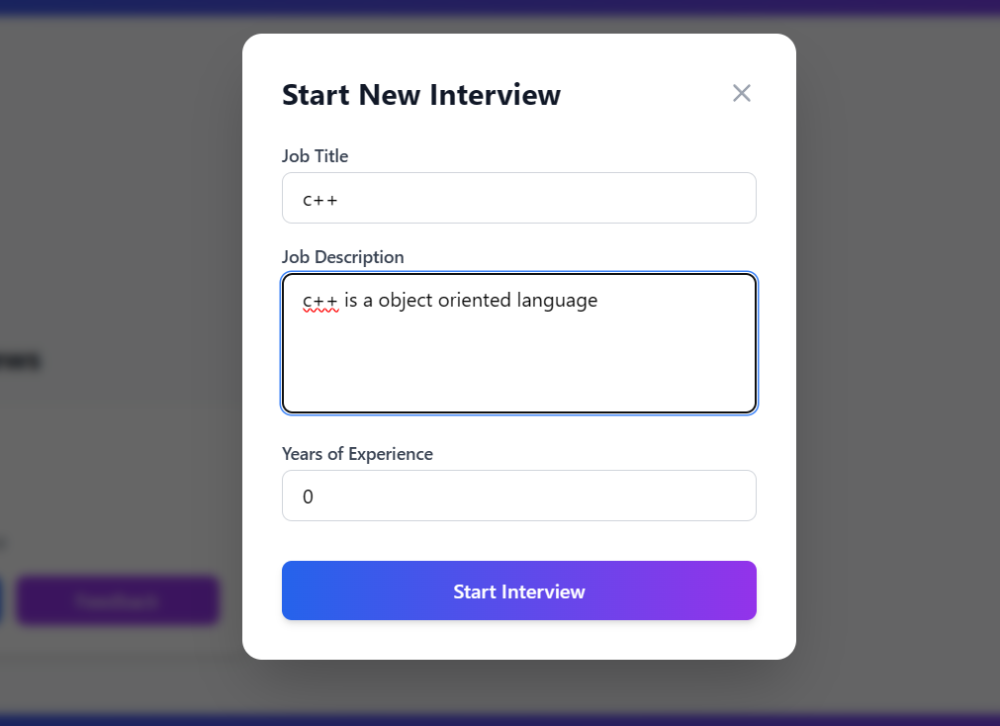
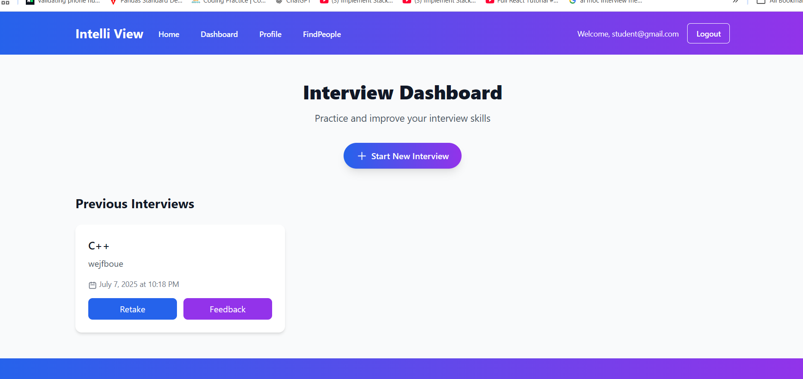
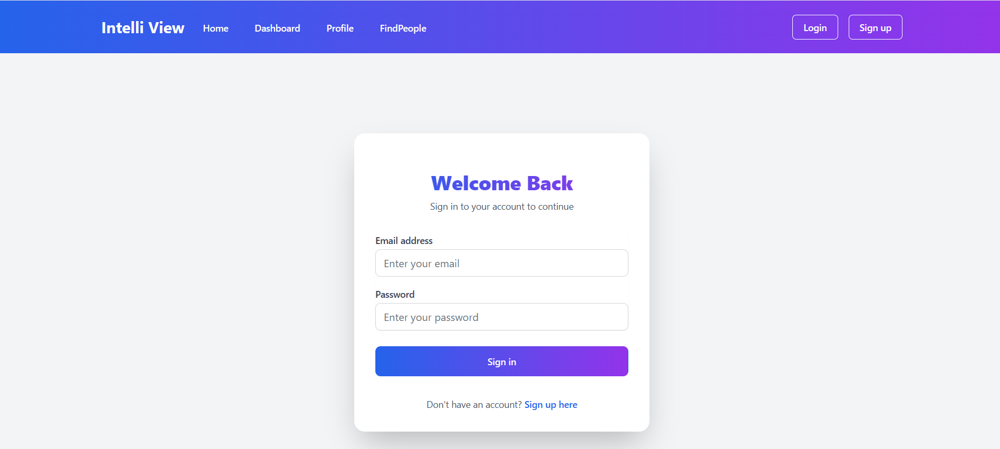
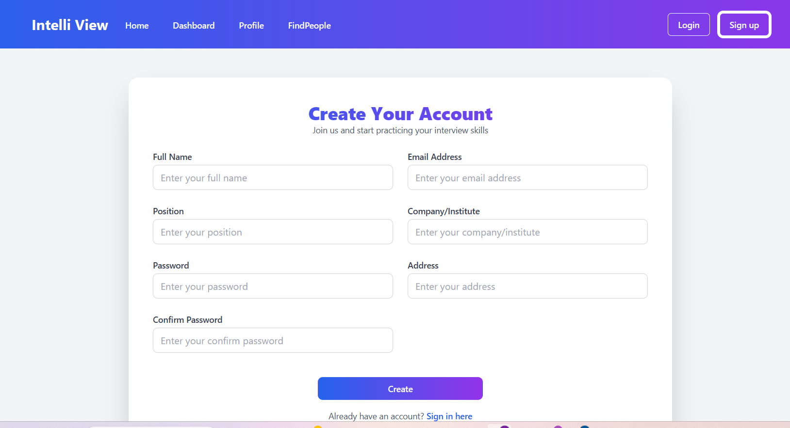

# 💼 IntelliView — AI Mock Interview Platform

A full-stack AI-powered mock interview platform that simulates real interviews using video/audio and provides AI-generated feedback.

---

## 🚀 Live Demo

🔗 [Launch IntelliView Platform](https://intelliview-frontend.onrender.com/login)

---

## 🧠 Key Features

- ✅ **AI-Generated Questions** based on job title, description, and experience
- 🎤 **Audio/Video Recording** with WebRTC + MediaRecorder
- 🤖 **AI Feedback** (Grammar, correctness, confidence)
- 🔒 **Secure Auth System** using JWT + Cookies
- 👨‍💼 **Admin Panel** for managing users and interview records
- ⚛️ **Zustand** state management
- 🌍 **Deployed on Render**

---

## 📁 Project Links

- 🔗 **Live Frontend**: [https://intelliview-frontend.onrender.com/login](https://intelliview-frontend.onrender.com/login)
- 🔗 **Live Backend**: [https://ai-backend-q9ta.onrender.com](https://ai-backend-q9ta.onrender.com)
- 🛠️ **GitHub Repo**: [AI Mock Interview Platform](https://github.com/Madhuritgithub/AI-Mock-Interview-Platform)

---

## 🧰 Tech Stack

- **Frontend**: React.js, Zustand, Tailwind CSS
- **Backend**: Node.js, Express.js, MongoDB
- **AI**: Groq API, Whisper, Mediapipe
- **Deployment**: Render

---

## 🧪 How to Use

1. Visit the platform
2. Sign up and log in
3. Start a mock interview
4. Answer the AI-generated questions via webcam/audio
5. Get personalized feedback instantly

---

# 🧠 Intelli View - AI Mock Interview Platform

Welcome to **Intelli View**, an AI-powered mock interview platform designed to help users practice and prepare for technical interviews.

---

## 🔐 Login Page

## 📝 Sign Up Page

## 📊 Dashboard

## 🚀 Start New Interview

## 💬 Feedback Page

## 👤 Profile Section

## 🔍 Find People Feature

## 🛠️ Admin Panel

## 📈 Interview Results Summary

---

## 📌 Author

**Madhu Mylapalli**  
[GitHub](https://github.com/Madhuritgithub)

